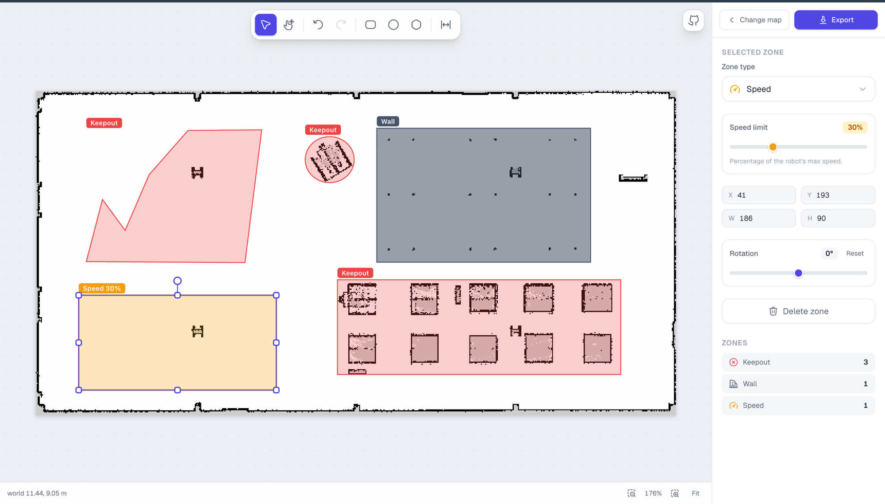

# Nav2 Costmap Filter Editor

### 👉 [Open the live app](https://vyshnav-tr.github.io/nav2-costmap-filter-editor/) — no install required

A browser-based editor for drawing **Nav2 costmap filter masks** — keepout zones, speed-limit zones and walls — directly on top of your ROS 2 occupancy map.

Load your `map.pgm` + `map.yaml`, draw zones with rectangle / ellipse / polygon tools, and export ready-to-use `.pgm` + `.yaml` mask pairs bundled in a single `.zip`. Everything runs **entirely in your browser** — your maps never leave your machine, and there is no backend to deploy.



## Features

- **Import** a standard ROS 2 map (`.pgm` image + `.yaml` metadata). PGM `P5` (binary) and `P2` (ASCII) are both supported.
- **Zone types**
  - **Keepout** — areas the robot must never enter (lethal).
  - **Speed limit** — restrict max speed in a region, set as a percentage.
  - **Wall** — baked into a copy of the map as occupied cells.
- **Drawing tools** — rectangle, ellipse/circle and free-form polygon, with a Canva-style editing experience: select, move, resize (8 handles), rotate, and per-vertex polygon editing.
- **Precise controls** — editable X / Y / W / H fields, rotation by handle or slider, live world-coordinate readout (using your map's resolution & origin).
- **Undo / redo**, pan & zoom, fit-to-screen, keyboard shortcuts.
- **Nav2-correct export** — masks are rasterized to match exactly what you draw (rotation- and polygon-aware) and written with the right `mode`/threshold values so `map_server` reconstructs the intended `OccupancyGrid`.

## Getting started

```bash
npm install
npm run dev
```

Open [http://localhost:3000](http://localhost:3000).

To build for production:

```bash
npm run build
npm start
```

## Usage

1. Drag-and-drop (or browse for) your `map.pgm` and `map.yaml`, then **Open editor**.
2. Pick a drawing tool and draw a zone. Switch to **Select** to move, resize, rotate or retype it.
3. Set each zone's type (Keepout / Wall / Speed) and, for speed zones, the speed-limit percentage.
4. Click **Export** to download `<map>_costmap.zip`.

### What's in the export

| File | When | Contents |
| --- | --- | --- |
| `<map>.pgm` / `.yaml` | always | Your map. Wall zones are baked in as occupied pixels. |
| `<map>_keepout.pgm` / `.yaml` | if keepout zones exist | Keepout filter mask (`mode: scale`). |
| `<map>_speed.pgm` / `.yaml` | if speed zones exist | Speed filter mask (`mode: scale`, value = % of max speed). |

These pairs drop straight into a Nav2 **Costmap Filters** setup (`KeepoutFilter` / `SpeedFilter`). See the
[Nav2 costmap filter tutorials](https://docs.nav2.org/tutorials/docs/navigation2_with_keepout_filter.html) for wiring the mask into your `costmap_filter_info` and lifecycle.

### Keyboard shortcuts

| Key | Action |
| --- | --- |
| `V` | Select |
| `R` / `O` / `P` | Rectangle / Ellipse / Polygon |
| `H` | Pan (also hold `Shift` while dragging) |
| `⌘/Ctrl + Z` · `⇧⌘/Ctrl + Z` | Undo · Redo |
| `Enter` / `Esc` | Finish / cancel a polygon |
| `Delete` / `Backspace` | Delete selected zone |

## Tech stack

- [Next.js](https://nextjs.org) (App Router) + React + TypeScript
- [Tailwind CSS](https://tailwindcss.com)
- [Hugeicons](https://hugeicons.com)
- HTML Canvas for rendering; zero runtime backend — all parsing, editing and ZIP packaging happen client-side.

## Contributing

Issues and pull requests are welcome. For local development:

```bash
npm install
npm run dev
npm run lint
```

## License

[MIT](./LICENSE)
